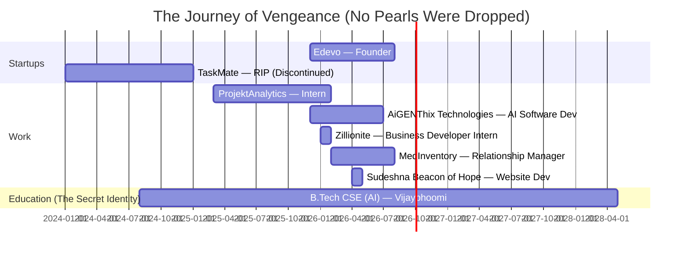

<div align="center">


[](https://github.com/vengeance0112)
[](https://github.com/vengeance0112?tab=followers)
[](https://github.com/vengeance0112)


<!-- SNAKE ANIMATION — dark/batman themed. Requires the GH Action in the comment near the bottom to actually be enabled, or this row stays blank. -->
<picture>
  <source media="(prefers-color-scheme: dark)" srcset="https://raw.githubusercontent.com/vengeance0112/vengeance0112/output/github-contribution-grid-snake-dark.svg" />
  <source media="(prefers-color-scheme: light)" srcset="https://raw.githubusercontent.com/vengeance0112/vengeance0112/output/github-contribution-grid-snake.svg" />
  
</picture>

> *"It's not who I am underneath, but what I commit that defines me."*

</div>

---


## 🦇 WHO AM I? (The Origin Story Nobody Asked For)

```typescript
const vengeance = {
    alias: "VENGEANCE (also Rajdeep, but that's classified)",
    identity: "Full Stack Developer · AI Software Engineer · Entrepreneur",
    year: "Third-Year B.Tech CSE (AI)",

    // Yes I have 4+ roles simultaneously.
    // No, I don't sleep. Batman doesn't sleep either.
    currentMissions: [
        "Edevo — Founder, saving students one feature at a time",
        "AiGENThix Technologies — AI Software Developer",
        "MedInventory — Relationship Manager (business-facing Alfred duties)",
        "Building VENGEANCE — a local, privacy-first AI desktop agent"
    ],

    base: "Vijaybhoomi University, Karjat, Maharashtra 🇮🇳",
    academicCover: "B.Tech CSE (AI) | CGPA: 8.7 | Class of 2028",

    motto: "I am vengeance. I am the night. I am… someone who missed standup again. 🚀",

    currentVentures: {
        startup: "Edevo — Student engagement platform (IIT Ropar pre-incubated, VC still thinking)",
        dayJob: "AI Software Developer @ AiGENThix Technologies Pvt. Ltd.",
        sideQuest: "Relationship Manager @ MedInventory + freelance builds for a cancer-support nonprofit"
    },

    // Achievement unlocked: Humble Bragging in a README
    batsignal_moments: [
        "🏆 IIT Ropar Pre-Incubation — They liked my pitch. Shocking.",
        "🌟 Stanford Alumni Fellowship Discussions — Name dropped correctly",
        "💼 6+ Roles/Orgs across 2 years — My calendar is a crime scene",
        "🎓 Gemini Student Ambassador & Perplexity Campus Partner — Google and AI startups both trust me now"
    ],

    // The most accurate thing in this entire README
    funFact: "I turn caffeine into code ☕ ➡️ 💻, and deadlines into superheroes 🦇"
};
```

<br clear="right"/>

<div align="center">

<details>
<summary>🦇 <b>Click if you dare — Classified Bat-File</b></summary>
<br/>

```
CASE FILE: VENGEANCE
STATUS: Active
KNOWN ALIASES: Rajdeep Kumar, "the guy who's always in 3 meetings at once"
LAST SEEN: Committing at 3:07 AM, muttering about a race condition
THREAT LEVEL: Moderate (mostly to his own sleep schedule)
KNOWN ASSOCIATES: Edevo, AiGENThix, MedInventory, a nonprofit for kids fighting cancer,
                   and a slowly-growing pile of side projects
WEAKNESS: Standup meetings, scope creep, and the word "quick call"
```

</details>

</div>

---

## 🦇 THE BATCAVE OPERATIONS *(Current Ventures)*

<table>
<tr>
<td width="50%">

### 🚀 Edevo *(Founder / Batman)*
**The Student Digital Platform Gotham Deserves**
- 📱 Engagement tools for students who actually check their phones
- 🎯 Activities, competitions, peer learning (social skills? in this economy?)
- 🏅 Pre-incubated at IIT Ropar — not just my mom this time
- 📊 Product, feature iteration, stakeholder wrangling *(translation: PowerPoint is ready)*

</td>
<td width="50%">

### 🤖 AiGENThix Technologies *(Alfred — The Reliable One)*
**AI Software Developer**
- ⚙️ AI-driven software solutions, design to deployment
- 🔧 Full stack development supporting real-world applications
- 🧪 Implementation, integration & testing *(the part nobody glamourizes but everyone needs)*

</td>
</tr>
<tr>
<td width="50%">

### 🤝 MedInventory *(Relationship Manager)*
**Business & Stakeholder Ops**
- 📞 Relationship management and stakeholder coordination
- 📈 Execution support for ongoing business initiatives
- 🕶️ Proof that Batman can also do a sales call

</td>
<td width="50%">

### ❤️ Sudeshna Beacon of Hope *(Website Developer)*
**Nonprofit, real stakes, zero sarcasm allowed here**
- 🌐 Built & deployed the official site for a nonprofit supporting kids fighting cancer
- 📱 Mobile-first, trust-focused, donation-conversion oriented
- 💛 The one project where the cape actually matters

</td>
</tr>
</table>

---

## ⚡ THE UTILITY BELT *(Tech Arsenal)*

> *"A good Batman always comes prepared. A great one over-engineers it."*

<div align="center">

### 🎨 Frontend — The Face of Gotham


### ⚙️ Backend — The Dark Knight's Infrastructure


### 🗄️ Databases — The Batcomputer's Memory


### 📱 Mobile — Gotham On The Go


### 🤖 AI & Machine Learning — The Batcomputer
> *"I don't outsource my intelligence. I just automate everything else."*


### ☁️ Cloud & DevOps — Gotham City Infrastructure
> *"The city needs me. Preferably with 99.9% uptime."*


### 🛠️ Dev Tools — The Batarangs


### 🎨 Design & Creative — Wayne Manor Aesthetics
> *"Bruce Wayne didn't wear just any suit."*


</div>

---

## 📊 THE BATCOMPUTER ANALYTICS *(GitHub Stats)*

> *"Data doesn't lie. My commit messages do though."*

<div align="center">


</div>

<div align="center">

[](https://github.com/vengeance0112)

</div>

> ⚠️ **Bat-Tech Note:** the streak stats, activity graph and snake animation are all live services that read your public contribution history — they'll self-heal automatically as you commit more. If the snake row above ever looks empty, it just means the GitHub Action that generates it (commented at the bottom of this file) isn't enabled yet on this repo.

---

## 🚀 THE CASE FILES *(Featured Projects)*

> *"Every great detective needs casework. Mine just happens to involve React — and lately, Rust."*

<div align="center">

<table>
<tr>
<td width="50%" valign="top">

### 🦇 VENGEANCE — Local AI Desktop Agent
> *"A privacy-first AI that doesn't phone home. Unlike me, apparently."*


**Autonomous, on-device AI agent**
- 🖥️ OS/browser automation + persistent memory + voice + screen understanding
- 🔐 Secure JSON-RPC IPC, permission controls, full audit trails
- 🧪 253+ automated tests across 10 dev phases *(yes I counted)*

</td>
<td width="50%" valign="top">

### 🧩 TeamFlow SaaS — Project Management Platform
> *"Kanban boards so I can pretend I'm organized."*


**Multi-tenant SaaS for teams**
- 📋 Kanban, Gantt charts, data grids, HR management
- 🔄 Real-time sync via Socket.IO
- 🤖 AI-powered automation baked in

</td>
</tr>
<tr>
<td width="50%" valign="top">

### 📚 Edevo Platform
> *"Wayne Enterprises, but for students. With less explosions."*


**Student engagement ecosystem**
- 🎯 Activities & competitions *(gamification, ethically)*
- 👨‍🎓 Peer collaboration, opportunity discovery
- 🏆 IIT Ropar pre-incubated *(they're legit, I checked)*

</td>
<td width="50%" valign="top">

### 🧠 CampusIntel — ML Lifecycle Platform
> *"Even Batman needs an ops dashboard."*


**End-to-end ML lifecycle & intel**
- 🔁 Model training, versioning, evaluation
- 📡 Real-time campus-event intelligence
- 📊 Actionable SQL-derived insights

</td>
</tr>
<tr>
<td width="50%" valign="top">

### 🌾 Kheti Khazana — Rural Farming Simulator
> *"Gotham has crime. Some villages have crop insurance math. Both need heroes."*


**Voice-first, offline financial literacy**
- 🎙️ Fully voice-driven, no internet required
- 🌱 Crop insurance, market dynamics, credit management scenarios

</td>
<td width="50%" valign="top">

### 💳 NeoFin Bank — Cloud Data Platform
> *"Fraud doesn't stand a chance against a well-indexed Snowflake pipeline."*


**Cloud-native banking analytics**
- 🏦 Transaction analytics & customer insights
- 🚨 Fraud-risk scoring pipeline

</td>
</tr>
</table>

<details>
<summary><b>🗂️ More Case Files (click to expand the rest of the Batcave archive)</b></summary>
<br/>

| Project | What It Does | Tech |
|---|---|---|
| **CaneSense AI** | Real-time cane-quality monitoring using Edge AI + RGB/IR/NIR sensors | Edge AI, IoT, Real-time Systems |
| **Cloud Scheduler ACO** | Task-to-processor allocation optimized with ant colony intelligence | Swarm Intelligence, ACO, Cloud Computing |
| **FuseCode** | Real-time P2P text-sharing with encrypted, low-latency sync | WebRTC, P2P, Encryption |
| **Business Revenue Simulation System** | Estimates revenue/profit/loss from configurable budgets & pricing | Python, Data Analytics, Simulation |
| **Student Mental Health Distress Prediction** | Predictive model flagging distress indicators, built for interpretability | Python, ML, Predictive Analysis |
| **TaskMate** | Hyperlocal services marketplace, location-based matching *(RIP, market-validated, then discontinued)* | React, Node.js |
| **Confidential Client Projects** | Websites & Android apps delivered for international clients (NDA'd, obviously) | Full Stack, Android |

</details>

</div>

---

## 🏆 THE HALL OF VICTORIES *(Achievements & Recognition)*

> *"Batman doesn't need validation. I do though. Desperately."*

<div align="center">

```
╔═══════════════════════════════════════════════════════════════════╗
║                                                                   ║
║   🦇  The Rogues Gallery of Achievements                         ║
║                                                                   ║
║   🎓  Gemini Student Ambassador                                  ║
║       (Yes I get the free stuff. No I won't share.)              ║
║                                                                   ║
║   🏛️  Perplexity Campus Partner                                  ║
║       (AI on AI action. Inception-level.)                        ║
║                                                                   ║
║   🚀  IIT Ropar Pre-Incubation Program (Edevo)                   ║
║       (Smartest people I've pitched to. Survived somehow.)       ║
║                                                                   ║
║   🌟  Stanford Alumni Fellowship Discussions                     ║
║       (Two words: Alumni. Discussions. We're getting there.)     ║
║                                                                   ║
║   💼  6+ Roles / Organizations, Concurrently                     ║
║       (My calendar is a work of horror fiction.)                 ║
║                                                                   ║
║   🎪  Organized National Events: ELEVATE, Jamrang                ║
║       (Hundreds of attendees. Zero nervous breakdowns. Publicly.) ║
║                                                                   ║
║   ❤️  Kanyathon Volunteer & Gyanoday Abhyasika Volunteer Teacher  ║
║       (Batman has a heart. It's just protected by armor.)        ║
║                                                                   ║
║   🌐  Built the site for Sudeshna Beacon of Hope (Nonprofit)     ║
║       (One project where the sarcasm takes a break.)             ║
║                                                                   ║
╚═══════════════════════════════════════════════════════════════════╝
```

</div>

### 🎯 Key Highlights — The Director's Cut

- 🏆 **IIT Ropar Recognition**: Edevo pre-incubated *(they've seen worse, but still)*
- 🤝 **Stanford Network**: Early-stage fellowship discussions with an alumni-led group *(I said Stanford. You saw it.)*
- 💼 **Multi-Threat**: Founder, AI Developer, Relationship Manager, and Website Developer for a nonprofit — *therapy is on the roadmap*
- 🎓 **Academic Excellence**: Maintaining 8.7 CGPA while juggling a startup and 3+ roles *(sleep is a scam)*
- 🌟 **Community Leader**: GDG member, Perplexity Campus Partner, Gemini Student Ambassador, event organizer, volunteer teacher *(Bruce Wayne had a PR team. I have LinkedIn.)*

</div>

---

## 💡 THE BATMAN TIMELINE *(Experience Journey)*

> *"Every hero has an origin story. Mine involves a lot of git commits and even more calendar invites."*



---

## 🎯 SKILL MATRIX — Assessed By The Batcomputer

> *"Not all heroes wear capes. Some wear hoodies and have 47 browser tabs open."*

<div align="center">

| Category | Skills | Bat-Level Proficiency |
|----------|--------|-------------|
| **🎨 Frontend** | React, TypeScript, HTML/CSS, Tailwind, Three.js |  |
| **⚙️ Backend** | Node.js, Express, FastAPI, Flask, REST APIs |  |
| **📱 Mobile** | Flutter, Dart, Kotlin, Android |  |
| **🤖 AI/ML** | Python, R, TensorFlow, PyTorch, scikit-learn |  |
| **🗄️ Database** | PostgreSQL, MongoDB, Supabase, Redis, Snowflake |  |
| **☁️ DevOps** | Git, GitHub Actions, AWS, Azure, Rust/Tauri packaging |  |
| **🎨 Design** | Figma, Adobe Suite, Blender, Framer |  |
| **📈 Business** | Market Research, BD, Stakeholder Management |  |
| **😴 Sleep** | REM Cycles, Power Naps, Caffeine Resistance |  |

</div>

---

## 🎲 INTERROGATE THE BATCOMPUTER *(Random Bat-Wisdom)*

<div align="center">

[](https://github.com/vengeance0112)

*Refresh this page for a new "quote." No guarantees it's actually about Batman.*

</div>

<details>
<summary>🕹️ <b>Konami Code Easter Egg (for the truly bored)</b></summary>
<br/>

You found the secret section. There's no code here — just this:

```
⬆️ ⬆️ ⬇️ ⬇️ ⬅️ ➡️ ⬅️ ➡️ 🅱️ 🅰️
RESULT: +30 lives, 0 additional sleep hours
```

Go build something instead. — Vengeance

</details>

<details>
<summary>📬 <b>Currently Debugging (auto-updates in my head, not on GitHub)</b></summary>
<br/>

```diff
+ Fixing: why the snake animation only renders when GitHub Actions feels like it
+ Fixing: broken glitch.me visitor badge (glitch.me shut down — swapped for a working one ✅)
- Fixing: my sleep schedule (WON'T FIX — by design)
```

</details>

---

## 🌐 THE BAT-SIGNAL *(Connect With Me)*

> *"Even Batman has a hotline. Mine just goes to Gmail."*

<div align="center">

[](https://linkedin.com/in/rajdeepgupta01)
[](mailto:rajdeepatwork01@gmail.com)
[](https://github.com/vengeance0112)
[](https://rajdeep-folio.vercel.app)

<br/>

> *"If you need me, I'll be in the Batcave. Also known as my dorm room at 3am."*


### 🦇 *"I am vengeance. I am the night. I am... a developer with too many side projects."* 🦇


</div>

---

<div align="center">

**🦇 Built with passion • Crafted with code • Powered by the belief that sleep is optional 🦇**

<sub>Last updated: Sep 2026 | The Dark Knight of Development | Karjat, Maharashtra, India</sub>

</div>

<!--
  TO ENABLE THE SNAKE ANIMATION (row near the top), add this GitHub Actions workflow to this repo:
  Path: .github/workflows/snake.yml

  name: Generate Snake Animation
  on:
    schedule:
      - cron: "0 */12 * * *"
    workflow_dispatch:
  jobs:
    build:
      runs-on: ubuntu-latest
      steps:
        - uses: Platane/snk@v3
          with:
            github_user_name: ${{ github.repository_owner }}
            outputs: |
              dist/github-contribution-grid-snake.svg
              dist/github-contribution-grid-snake-dark.svg?palette=github-dark
        - uses: crazy-max/ghaction-github-pages@v3.1.0
          with:
            target_branch: output
            build_dir: dist
          env:
            GITHUB_TOKEN: ${{ secrets.GITHUB_TOKEN }}

  Also make sure repo Settings > Actions > General has "Read and write permissions"
  turned on for the workflow token, or the "output" branch will never get created
  and the snake row above will stay blank.
-->
