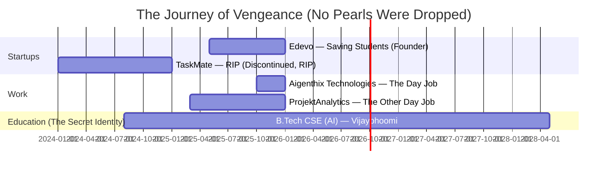

<div align="center">


[](https://github.com/vengeance0112)
[](https://github.com/vengeance0112?tab=followers)
[](https://github.com/vengeance0112)

<!-- SNAKE ANIMATION — dark/batman themed -->
<picture>
  <source media="(prefers-color-scheme: dark)" srcset="https://raw.githubusercontent.com/vengeance0112/vengeance0112/output/github-contribution-grid-snake-dark.svg" />
  <source media="(prefers-color-scheme: light)" srcset="https://raw.githubusercontent.com/vengeance0112/vengeance0112/output/github-contribution-grid-snake.svg" />
  
</picture>

> *"It's not who I am underneath, but what I commit that defines me."*

</div>

---


## 🦇 WHO AM I? (The Origin Story Nobody Asked For)

```typescript
const vengeance = {
    alias: "VENGEANCE (also Rajdeep, but that's classified)",
    identity: "Full Stack Developer & AI Engineer",
    
    // Yes I have 3 roles simultaneously.
    // No, I don't sleep. Batman doesn't sleep either.
    currentMissions: [
        "Edevo Platform — saving students one feature at a time",
        "AI Systems — teaching machines to think so I don't have to",
        "Startup Building — burning money responsibly"
    ],
    
    base: "Vijaybhoomi University, Maharashtra 🇮🇳",
    academicCover: "B.Tech CSE (AI) | CGPA: 8.6 (Bruce Wayne got grades too)",
    
    motto: "I am vengeance. I am the night. I am… someone who missed standup again. 🚀",

    currentVentures: {
        startup: "Edevo — Student engagement platform (IIT Ropar approved, VC still thinking)",
        dayJob: "AI Software Developer @ Aigenthix",
        sideQuest: "Government of Maharashtra Projects (yes, the actual government)"
    },

    // Achievement unlocked: Humble Bragging in a README
    batsignal_moments: [
        "🏆 IIT Ropar Pre-Incubation — They liked my pitch. Shocking.",
        "🌟 Stanford Alumni Fellowship Discussions — Name dropped correctly",
        "💼 3+ Active Internships/Roles — My calendar is a crime scene",
        "🎓 Google Student Ambassador — Google trusts me. Weird, I know."
    ],

    // The most accurate thing in this entire README
    funFact: "I turn caffeine into code ☕ ➡️ 💻, and deadlines into superheroes 🦇"
};
```

<br clear="right"/>

---

## 🦇 THE BATCAVE OPERATIONS *(Current Ventures)*

<table>
<tr>
<td width="50%">

### 🚀 Edevo *(Founder / Batman)*
**The Student Digital Platform Gotham Deserves**
- 📱 Engagement tools for students who actually check their phones
- 🎯 Activities, competitions, peer learning (social skills? in this economy?)
- 🏅 Recognized by IIT Ropar — not just my mom this time
- 📊 Early-stage funding discussions *(translation: PowerPoint is ready)*

</td>
<td width="50%">

### 🤖 Aigenthix Technologies *(Alfred — The Reliable One)*
**AI Software Developer Intern**
- 🏛️ Government of Maharashtra projects — *actual* government, not a hackathon
- ⚙️ AI-enabled software systems (making bureaucracy bearable since 2025)
- 🔧 Full stack development
- 🧪 Testing & integration *(the part nobody glamourizes but everyone needs)*

</td>
</tr>
</table>

---

## ⚡ THE UTILITY BELT *(Tech Arsenal)*

> *"A good Batman always comes prepared. A great one over-engineers it."*

<div align="center">

### 🎨 Frontend — The Face of Gotham


### ⚙️ Backend — The Dark Knight's Infrastructure


### 🗄️ Databases — The Batcomputer's Memory


### 📱 Mobile — Gotham On The Go


### 🤖 AI & Machine Learning — The Batcomputer
> *"I don't outsource my intelligence. I just automate everything else."*


### ☁️ Cloud & DevOps — Gotham City Infrastructure
> *"The city needs me. Preferably with 99.9% uptime."*


### 🛠️ Dev Tools — The Batarangs


### 🎨 Design & Creative — Wayne Manor Aesthetics
> *"Bruce Wayne didn't wear just any suit."*


</div>

---

## 📊 THE BATCOMPUTER ANALYTICS *(GitHub Stats)*

> *"Data doesn't lie. My commit messages do though."*

<div align="center">


</div>

<div align="center">

[](https://github.com/vengeance0112)

[](https://github.com/vengeance0112)

</div>

---

## 🚀 THE CASE FILES *(Featured Projects)*

> *"Every great detective needs casework. Mine just happens to involve React."*

<div align="center">

<table>
<tr>
<td width="50%" valign="top">

### 📊 Business Revenue Simulator
> *"Money is not Batman's problem. Revenue modeling is."*


**Advanced analytics system for revenue modeling**
- 🔢 Configurable scenarios & budgets *(because assumptions are expensive)*
- 📈 Profit/loss estimation *(mostly loss, early stage)*
- 🎯 Multi-variable analysis
- 💼 Business intelligence tools

</td>
<td width="50%" valign="top">

### 🧠 Mental Health AI Predictor
> *"Even Batman needed a therapist. We just automated it."*


**ML model for student wellness**
- 🤖 Predictive modeling *(not a replacement for actual therapy)*
- 📊 Statistical analysis
- 🎓 Student-focused approach
- ⚖️ Ethical AI principles *(yes, those exist)*

</td>
</tr>
<tr>
<td width="50%" valign="top">

### 📚 Edevo Platform
> *"Wayne Enterprises, but for students. With less explosions."*


**Student engagement ecosystem**
- 🎯 Activities & competitions *(gamification, ethically)*
- 👨‍🎓 Peer collaboration
- 📱 Mobile-first design
- 🏆 IIT Ropar recognized *(they're legit, I checked)*

</td>
<td width="50%" valign="top">

### 🏘️ TaskMate Platform
> *"Tried to solve Gotham's odd-jobs problem. Gotham wasn't ready."*


**Hyperlocal services marketplace**
- 📱 Full stack application
- 🗺️ Location-based matching
- 👥 User & provider systems
- 🔍 Market validated prototype *(and then promptly discontinued)*

</td>
</tr>
</table>

</div>

---

## 🏆 THE HALL OF VICTORIES *(Achievements & Recognition)*

> *"Batman doesn't need validation. I do though. Desperately."*

<div align="center">

```
╔═══════════════════════════════════════════════════════════════════╗
║                                                                   ║
║   🦇  The Rogues Gallery of Achievements                         ║
║                                                                   ║
║   🎓  Google Student Ambassador                                  ║
║       (Yes I get the free stuff. No I won't share.)              ║
║                                                                   ║
║   🏛️  Campus Partner — Perplexity AI                             ║
║       (AI on AI action. Inception-level.)                        ║
║                                                                   ║
║   🚀  IIT Ropar Pre-Incubation Program                           ║
║       (Smartest people I've pitched to. Survived somehow.)       ║
║                                                                   ║
║   🌟  Stanford Alumni Fellowship Discussions                     ║
║       (Two words: Alumni. Discussions. We're getting there.)     ║
║                                                                   ║
║   💼  Active in 6+ Organizations                                 ║
║       (My calendar is a work of horror fiction.)                 ║
║                                                                   ║
║   🎪  Organized National Events: ELEVATE, Jamrang                ║
║       (Hundreds of attendees. Zero nervous breakdowns. Publicly.) ║
║                                                                   ║
║   ❤️  Social Impact — Kanyathon Volunteer                        ║
║       (Batman has a heart. It's just protected by armor.)        ║
║                                                                   ║
║   📈  3+ Active Internships/Roles Simultaneously                 ║
║       (My LinkedIn is a fever dream.)                            ║
║                                                                   ║
╚═══════════════════════════════════════════════════════════════════╝
```

</div>

### 🎯 Key Highlights — The Director's Cut

- 🏆 **IIT Ropar Recognition**: Edevo accepted into pre-incubation program *(they've seen worse, but still)*
- 🤝 **Stanford Network**: Early-stage fellowship discussions with alumni-led group *(I said Stanford. You saw it.)*
- 💼 **Triple Threat**: Simultaneously Founder, AI Developer, and Business Intern — *therapy is on the roadmap*
- 🎓 **Academic Excellence**: Maintaining 8.6 CGPA while building startups *(sleep is a scam)*
- 🌟 **Community Leader**: Google Developer Groups, event organizer, social volunteer *(Bruce Wayne had a PR team. I have LinkedIn.)*

---

## 💡 THE BATMAN TIMELINE *(Experience Journey)*

> *"Every hero has an origin story. Mine involves a lot of git commits."*



---

## 🎯 SKILL MATRIX — Assessed By The Batcomputer

> *"Not all heroes wear capes. Some wear hoodies and have 47 browser tabs open."*

<div align="center">

| Category | Skills | Bat-Level Proficiency |
|----------|--------|-------------|
| **🎨 Frontend** | React, TypeScript, HTML/CSS, Tailwind |  |
| **⚙️ Backend** | Node.js, Express, FastAPI, REST APIs |  |
| **📱 Mobile** | Flutter, Dart, Android |  |
| **🤖 AI/ML** | Python, TensorFlow, PyTorch, scikit-learn |  |
| **🗄️ Database** | PostgreSQL, MongoDB, Supabase, Redis |  |
| **☁️ DevOps** | Git, GitHub Actions, AWS, Azure |  |
| **🎨 Design** | Figma, Adobe Suite, Blender |  |
| **📈 Business** | Market Research, BD, Stakeholder Management |  |
| **😴 Sleep** | REM Cycles, Power Naps, Caffeine Resistance |  |

</div>

---

## 🌐 THE BAT-SIGNAL *(Connect With Me)*

> *"Even Batman has a hotline. Mine just goes to Gmail."*

<div align="center">

[](https://linkedin.com/in/rajdeepgupta01)
[](mailto:rajdeepatwork01@gmail.com)
[](https://github.com/vengeance0112)
[](https://twitter.com/vengeance)
[](https://vengeance.dev)

<br/>

> *"If you need me, I'll be in the Batcave. Also known as my dorm room at 3am."*


### 🦇 *"I am vengeance. I am the night. I am... a developer with too many side projects."* 🦇


<br/>


</div>

---

<div align="center">

**🦇 Built with passion • Crafted with code • Powered by the belief that sleep is optional 🦇**

<sub>Last updated: 2026 | The Dark Knight of Development | Maharashtra, India</sub>

</div>

<!-- 
  TO ENABLE THE SNAKE ANIMATION, add this GitHub Actions workflow to your repo:
  Path: .github/workflows/snake.yml
  
  name: Generate Snake Animation
  on:
    schedule:
      - cron: "0 */12 * * *"
    workflow_dispatch:
  jobs:
    build:
      runs-on: ubuntu-latest
      steps:
        - uses: Platane/snk@v3
          with:
            github_user_name: ${{ github.repository_owner }}
            outputs: |
              dist/github-contribution-grid-snake.svg
              dist/github-contribution-grid-snake-dark.svg?palette=github-dark
        - uses: crazy-max/ghaction-github-pages@v3.1.0
          with:
            target_branch: output
            build_dir: dist
          env:
            GITHUB_TOKEN: ${{ secrets.GITHUB_TOKEN }}
-->
