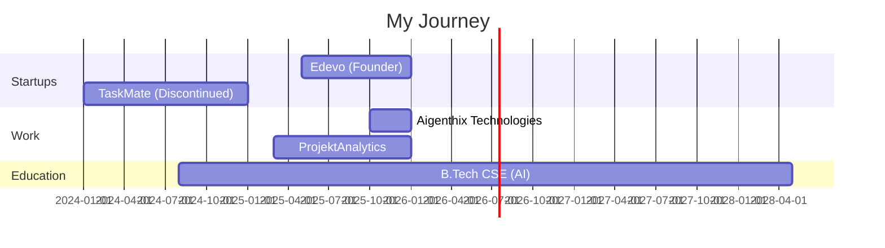

<div align="center">

# 『 VENGEANCE 』


[](https://github.com/vengeance0112)
[](https://github.com/vengeance0112?tab=followers)
[](https://github.com/vengeance0112)

</div>

---


## 🎯 WHO AM I?

```typescript
const vengeance = {
    identity: "Full Stack Developer & AI Engineer",
    currentFocus: ["Edevo Platform", "AI Systems", "Startup Building"],
    education: "B.Tech CSE (AI) @ Vijaybhoomi | CGPA: 8.6",
    location: "Maharashtra, India 🇮🇳",
    motto: "Building solutions that matter 🚀",
    
    workingOn: {
        startup: "Edevo - Student engagement platform",
        role: "AI Software Developer @ Aigenthix",
        collaboration: "Government of Maharashtra Projects"
    },
    
    achievements: [
        "🏆 IIT Ropar Pre-Incubation",
        "🌟 Stanford Alumni Fellowship Discussions",
        "💼 3+ Active Internships/Roles",
        "🎓 Google Student Ambassador"
    ],
    
    funFact: "I turn caffeine into code ☕➡️💻"
};
```

<br clear="right"/>

---

## 💼 CURRENT VENTURES

<table>
<tr>
<td width="50%">

### 🚀 Edevo (Founder)
**Student Digital Platform**
- 📱 Building engagement tools for students
- 🎯 Activities, competitions, peer learning
- 🏅 Recognized by IIT Ropar
- 📊 Early-stage funding discussions

</td>
<td width="50%">

### 🤖 Aigenthix Technologies
**AI Software Developer Intern**
- 🏛️ Government of Maharashtra projects
- ⚙️ AI-enabled software systems
- 🔧 Full stack development
- 🧪 Testing & integration

</td>
</tr>
</table>

---

## ⚡ TECH ARSENAL

<div align="center">

### 🎨 Frontend Mastery


### ⚙️ Backend Power


### 🗄️ Database Expertise


### 📱 Mobile Development


### 🤖 AI & Machine Learning


### ☁️ Cloud & DevOps


### 🛠️ Development Tools


### 🎨 Design & Creative


</div>

---

## 📊 GITHUB ANALYTICS

<div align="center">


</div>

<div align="center">
  
[](https://github.com/vengeance0112)

[](https://github.com/vengeance0112)

</div>

---

## 🚀 FEATURED PROJECTS

<div align="center">

<table>
<tr>
<td width="50%" valign="top">

### 📊 Business Revenue Simulator


**Advanced analytics system for revenue modeling**

- 🔢 Configurable scenarios & budgets
- 📈 Profit/loss estimation
- 🎯 Multi-variable analysis
- 💼 Business intelligence tools

</td>
<td width="50%" valign="top">

### 🧠 Mental Health AI Predictor


**ML model for student wellness**

- 🤖 Predictive modeling
- 📊 Statistical analysis
- 🎓 Student-focused approach
- ⚖️ Ethical AI principles

</td>
</tr>
<tr>
<td width="50%" valign="top">

### 📚 Edevo Platform


**Student engagement ecosystem**

- 🎯 Activities & competitions
- 👨‍🎓 Peer collaboration
- 📱 Mobile-first design
- 🏆 IIT Ropar recognized

</td>
<td width="50%" valign="top">

### 🏘️ TaskMate Platform


**Hyperlocal services marketplace**

- 📱 Full stack application
- 🗺️ Location-based matching
- 👥 User & provider systems
- 🔍 Market validated prototype

</td>
</tr>
</table>

</div>

---

## 🏆 ACHIEVEMENTS & RECOGNITION

<div align="center">

```ascii
╔═══════════════════════════════════════════════════════════╗
║                                                           ║
║  🎓  Google Student Ambassador                           ║
║  🏛️  Campus Partner - Perplexity AI                      ║
║  🚀  IIT Ropar Pre-Incubation Program                    ║
║  🌟  Stanford Alumni Fellowship Discussions              ║
║  💼  Active in 6+ Organizations                          ║
║  🎪  Organized National Events (ELEVATE, Jamrang)        ║
║  ❤️  Social Impact - Kanyathon Volunteer                 ║
║  📈  3+ Active Internships/Roles                         ║
║                                                           ║
╚═══════════════════════════════════════════════════════════╝
```

</div>

### 🎯 Key Highlights

- 🏆 **IIT Ropar Recognition**: Edevo accepted into pre-incubation program
- 🤝 **Stanford Network**: Early-stage fellowship discussions with alumni-led group
- 💼 **Triple Role**: Simultaneously working as Founder, AI Developer, and Business Intern
- 🎓 **Academic Excellence**: Maintaining 8.6 CGPA while building startups
- 🌟 **Community Leader**: Google Developer Groups member, event organizer, social volunteer

---

## 💡 EXPERIENCE TIMELINE



---

## 🎯 SKILL MATRIX

<div align="center">

| Category | Skills | Proficiency |
|----------|--------|-------------|
| **Frontend** | React, TypeScript, HTML/CSS, Tailwind |  |
| **Backend** | Node.js, Express, FastAPI, REST APIs |  |
| **Mobile** | Flutter, Dart, Android |  |
| **AI/ML** | Python, TensorFlow, PyTorch, scikit-learn |  |
| **Database** | PostgreSQL, MongoDB, Supabase, Redis |  |
| **DevOps** | Git, GitHub Actions, AWS, Azure |  |
| **Design** | Figma, Adobe Suite, Blender |  |
| **Business** | Market Research, BD, Stakeholder Management |  |

</div>

---

## 🌐 CONNECT WITH ME

<div align="center">

[](https://linkedin.com/in/rajdeepgupta01)
[](mailto:rajdeepatwork01@gmail.com)
[](https://github.com/vengeance0112)
[](https://twitter.com/vengeance)
[](https://vengeance.dev)


<br/>


### ⚡ "Code is Poetry, Innovation is Art" ⚡


<br/>


</div>

---

<div align="center">

**💫 Built with passion • Crafted with code • Powered by innovation 💫**

<sub>Last updated: January 2026</sub>

</div>
